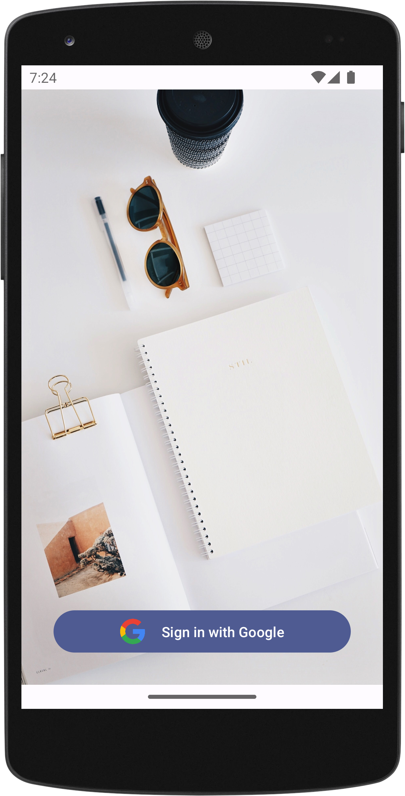
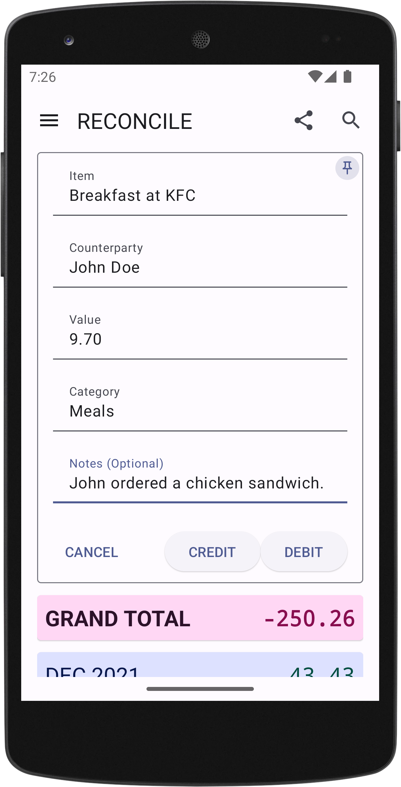
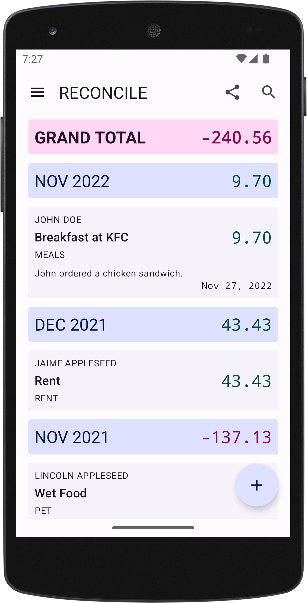
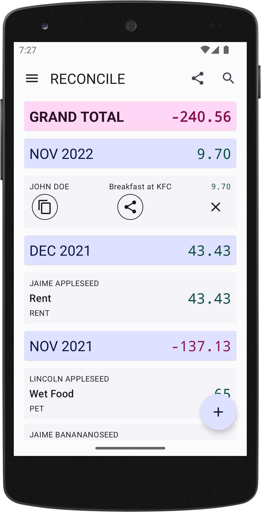
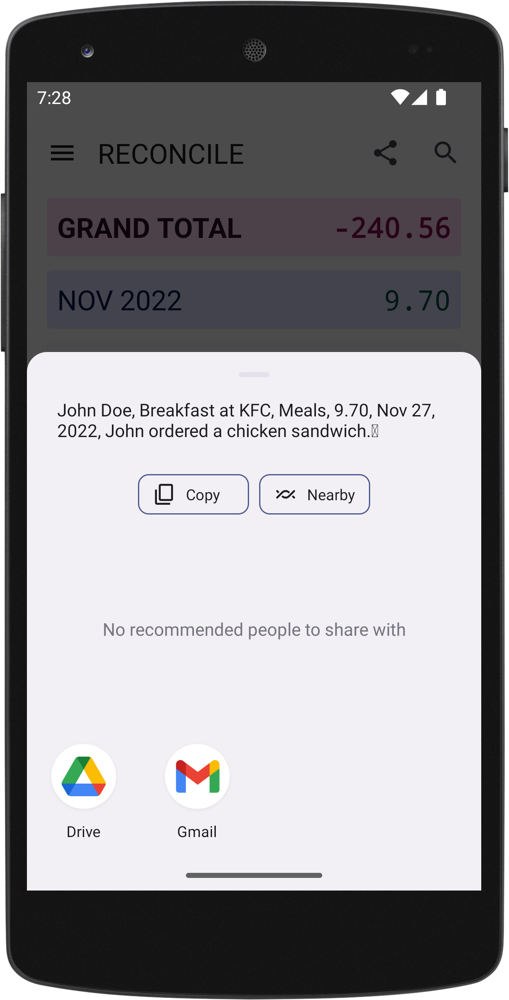
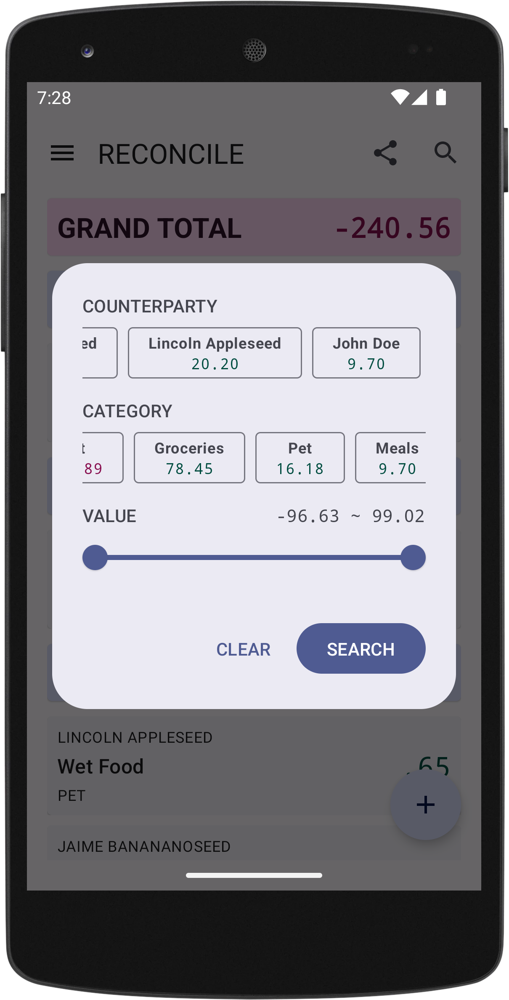
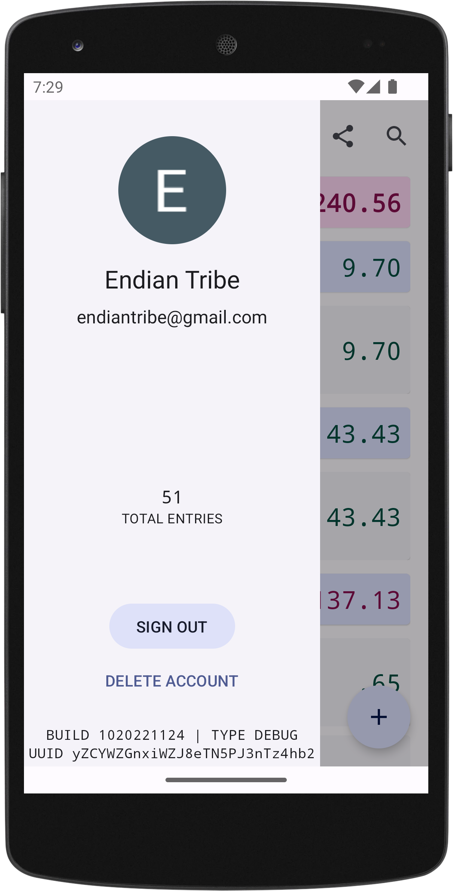

## Download the App

Use [this link](https://play.google.com/apps/internaltest/4701718537664687824) to download the app from Google Play Store.

*Note that you may need to request to be added to the internal test list before you can access the app.*

## Log In

If you are on an Android phone signed into your Google account, logging in is as easy as tapping the "Sign In" button. Your ledger stays with the associated Google account. This means that when you sign in on another device using the same Google account, you will see the latest version of your ledger regardless of your location.

## Log a Journal Entry

Tap the plus button at the bottom right corner of the app then fill in the journal entry information. As an example, John Doe and you had breakfast at KFC. You paid the bill and John agrees to pay you back $9.7.

* **Item**: The actual item that incurred the expense. In our example, it would be *Breakfast at KFC*.
* **Counterparty**: Who is this expense related to? In our example, it would be *John Doe*.
* **Value**: The amount of the expense. In our example, it would be *9.7*.
* **Category**: The category to which you wish to assign the expense. In our example, it could be *Meals*.
* **Notes**: The notes you wish to attached to this journal entry. In our example, it could be *John ordered a chicken sandwich*.

Because John owes us money, from our perspective this journal entry is a debit transaction, we then tap *Debit* to finalize the journal entry.

## Review Journal Entry Detail

Once the journal entry is added, it immediately appears at the top of the ledger, which is sorted in reverse chronological order. Timestamps are automatically added when you create journal entries. Once a journal entry is created, it cannot be edited or removed. See [a brief explanation here](https://reconcile.endiantribe.com/docs/overview/rules-of-accounting/).

Tap on the journal entry to expand it to see more detail including notes and timestamp.

## Duplicate Journal Entry

At some point you may find yourself wanting to duplicate a journal entry. For instance, there may be a reoccurring item and you don't want to retype all the expense details. Or you may have an item that you entered incorrectly and want to reverse the entry.

Long press on the target journal entry and then tap on the duplicate icon. This action brings up the journal entry addition interface and populates the fields with the targeted journal entry's information. Once you confirm the prepopulated details (and optionally make any necessary changes), tap on the appropriate Debit or Credit button to finalize the journal entry.

## Share Journal Entry

Long press on the target journal entry and then tap on the share icon. This action sends the comma-delimited text string of the current journal entry to your Android phone's sharing dialogue box. From there, you can share the expense item as plain text to any of your favorite apps.

## Filter Journal Entries

What if I want to see how much someone owes you? Or you want to peruse everything in the groceries category with another person? You can use the filter function.

* Tap the search button at the top right corner of the screen.
* Make the appropriate filter selections. The grand total of every category and counterparty is conveniently displayed below their names. They are also sorted in decreasing order of magnitude so you can always see the most important ones first.
* Tap "Search." Your outstanding balance using the selected criteria is at the top of the ledger. Remember, a positive number is a debit, which means the *world* (as defined by your search criteria) owes you. A negative number is a credit, which means you owe the *world* (as defined by your search criteria).

## Share Ledger

You can share everything that is displayed on the screen as comma-delimited text by tapping on the filter button right next to the filter button on the top of the app bar. Note that if there is an active filter applied, only the filtered result is going to appear in the sharable text.

## Check Account Status

You can check your account status by tapping the hamburger icon at the top left corner of the app. You can also sign out or delete your account on this page.

## Offline Support

Most of Reconcile's functionalities do not require an internet connection. You can continue to view, filter, and add journal entries even if you are offline. However, you will need an active internet connection for the following:

* Signing in and out of the account
* Deleting the account
* Syncing (which happens automatically) your local ledger with the cloud
