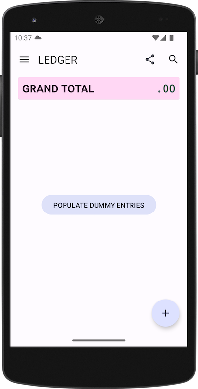
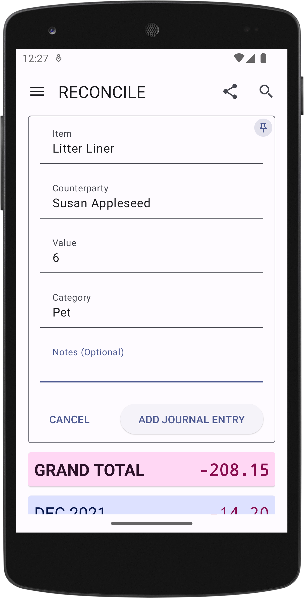
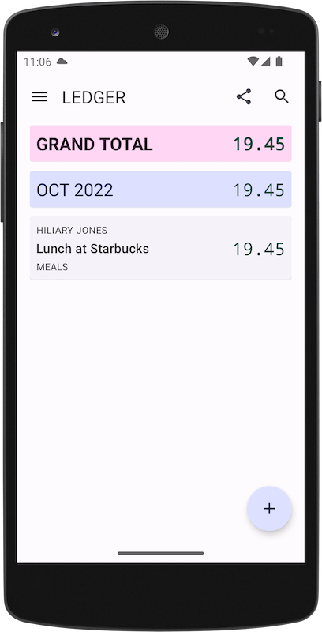
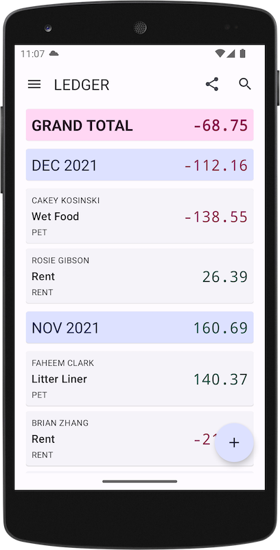
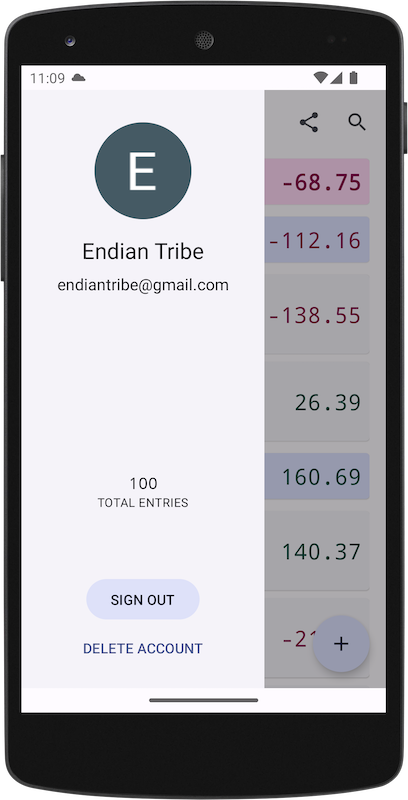
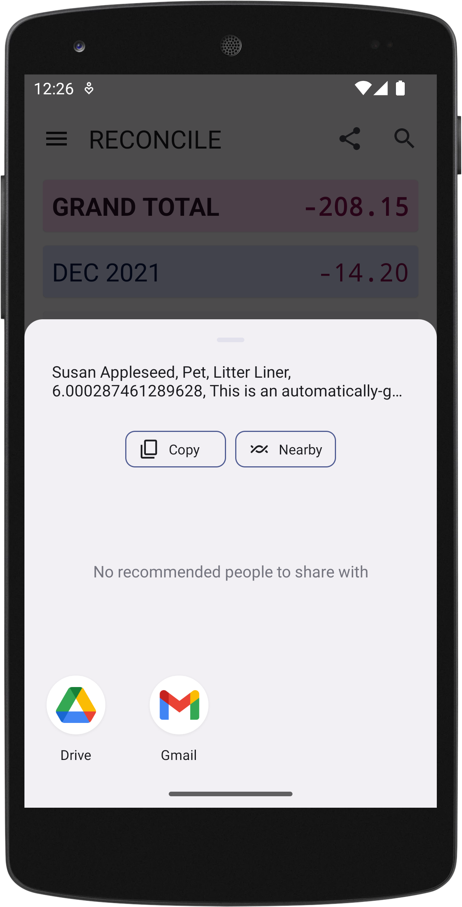
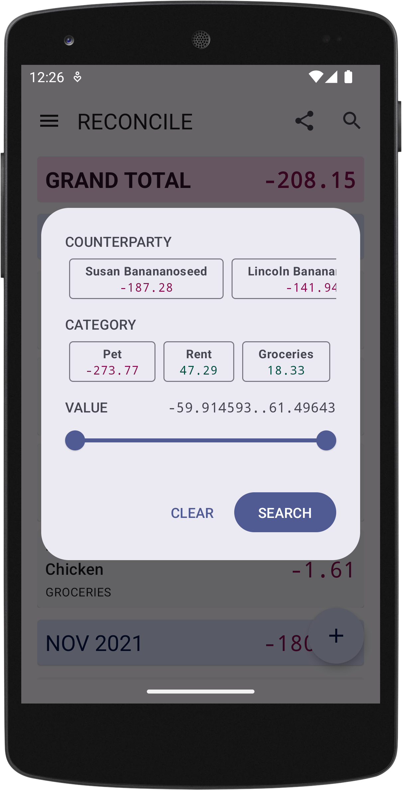

Thank you for participating in the exclusive internal test program of [Reconcile the Android app](https://play.google.com/apps/internaltest/4701718537664687824). This page will explain to you the app’s purpose, its current implementation, and your role in the test process.

## Important Disclosures

This app is in its early stages of development and should not be relied upon for any tasks. Your data may be wiped at any time without notice. Additionally the app has not undergone any stringent security audits. You should not submit any confidential information. Hackers be crazy nowadays.

You may also be interested in reading the current [Privacy Policy](https://reconcile.endiantribe.com/privacy-policy/).

## App’s Purpose

Reconcile is a personal ledger app. It tracks your financial position against other individuals. Why do you need it? Consider some of the use cases I [enumerated here](https://reconcile.endiantribe.com/docs/overview/use-cases/).

## App’s Implementation

First, you will sign in through Google for the app to identify you.

Once signed in, you are presented with a blank ledger. This is the page that displays all journal entries. If a search filter is applied, it would then display the corresponding search results.

A journal entry is simply an expense line item that is associated with another individual entity. At this moment, you have none. Let’s create one.

Imagine you just went to lunch with Hiliary Jones and the charges were put on your credit card. Now Hiliary Jones owes you $19.45.

Click on the plus button at the bottom right corner of the screen. Then enter the details as such. Because Hiliary owes you, from your perspective, it will be a debit transaction. Press the “DEBIT” button to finalize the journal entry.

It is important to note that once a journal entry is created, it cannot be altered in any way. See a [brief explanation here](https://reconcile.endiantribe.com/docs/overview/rules-of-accounting/).

Now the ledger screen is updated with your latest journal entry along with cumulative stats by month and in total. You can continue to add more journal entries as you see fit.

To explore more of the app’s functionalities, I will now use an instance of the app with random fake data.

You can see your account’s status by sliding right on the screen or pressing the hamburger button on the top left corner of the screen.

You can share what is shown on the screen in text form by clicking on the share button to the left of the search button on the menu bar.

You can search for all journal entries related to specific individuals by clicking on the search button on the top right corner of the screen. Note that when a search filter is applied, statistics displayed on the ledger screen only account for the filtered journal entries.

## Your Role

You can join the [test program here](https://play.google.com/apps/internaltest/4701718537664687824). Please note that until I get around to work on the app store listing, you will be seeing a picture of my cat on the Google Play Store.

### App Design

Does my app fulfill its purpose? What additional features would enhance the user experience? For inspiration you can peruse a [long list of features](https://reconcile.endiantribe.com/docs/under_the_hood/future-plans/) I have planned here.

### App Implementation

Do you experience any bugs, glitches, unexpected and undesirable behavior?

### Experienced Android Developers

If you are an experienced Android developer, I would appreciate any input regarding my infrastructure setup, [which I describe here](https://reconcile.endiantribe.com/docs/under_the_hood/technical-details/). Are there any interesting libraries, tools, and infrastructure options I should consider?

## Communication

I expect the testing to last over a period of time as I continue to develop the app. You should be receiving updated versions of the app as soon as they become available. You should always be testing on the latest version.

I will communicate with you mostly through email. Should you wish to be removed from the program, simply respond to any of my emails as such.

You can always communicate with me through email. However, the preferred method for submitting issues and feature requests is using [Github’s issue tracker here](https://github.com/EndianTribe/Reconcile-Issues-Tracker-Public/issues). Please note that this repository is just for tracking issues. The codebase lives elsewhere.
